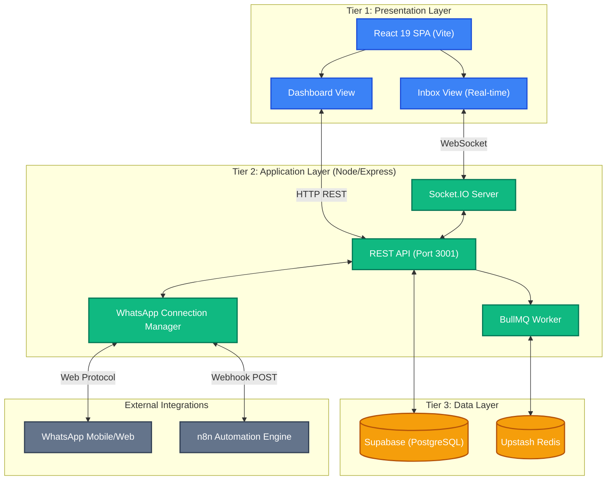
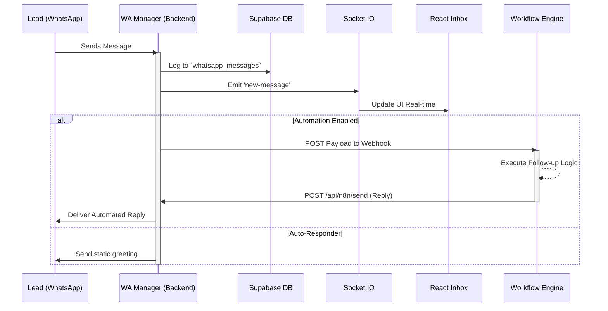

# SalesAI — Outreach & CRM Platform

**SalesAI** is a comprehensive, B2B Customer Relationship Management (CRM) platform designed to automate sales outreach, manage leads, and handle real-time WhatsApp communication. It integrates powerful workflow automation engines to ensure sales teams never miss a follow-up.

---

## 🚀 Key Features

- **Real-Time WhatsApp Inbox:** Communicate seamlessly with leads via an integrated WhatsApp Web interface (powered by Baileys & Socket.IO).
- **Automated Workflows:** Trigger custom follow-up sequences using external webhooks (n8n integration).
- **Intelligent Lead Management:** Score leads, track pipeline status, and import/export CSV data easily.
- **Activity Scheduling:** Manage sales meetings and calendar events.
- **Dynamic Dashboard:** View real-time analytics, pipeline health, and pending approvals.

---

## 🛠️ Technology Stack

| Layer | Technology | Purpose |
|-------|-----------|---------|
| **Frontend** | React 19, Vite, Tailwind CSS | High-performance Single Page Application (SPA). |
| **Backend** | Node.js, Express.js (Port 3001) | REST API and WebSocket server. |
| **Real-time** | Socket.IO | Bidirectional communication for the Inbox. |
| **Database & Auth** | Supabase (PostgreSQL) | Secure data storage and JWT authentication. |
| **Messaging** | `@whiskeysockets/baileys` | Direct WhatsApp Web protocol integration. |
| **Queueing** | BullMQ + Upstash Redis | Reliable background job processing. |

---

## 📐 System Architecture

The following diagram outlines the system's robust 3-tier architecture.



---

## 🔄 Data Flows

### Inbound Message Sequence
This sequence illustrates how the system handles incoming WhatsApp messages and triggers automated workflows.



---

## 💻 Local Development Setup

Follow these steps to run the SalesAI platform locally.

### Prerequisites
- Node.js (v20+ recommended)
- An active Supabase project
- An Upstash Redis instance

### 1. Installation
Clone the repository and install the required dependencies:
```bash
npm install
```

### 2. Environment Configuration
Create a `.env.local` or update the existing `.env` file in the root directory with your credentials:
```env
VITE_SUPABASE_URL=your_supabase_url
VITE_SUPABASE_ANON_KEY=your_supabase_anon_key
SUPABASE_SERVICE_ROLE_KEY=your_supabase_service_role_key
REDIS_URL=your_upstash_redis_url
PORT=3001
```

### 3. Database Migration
Ensure your Supabase database is properly configured. 
- Run the SQL migration scripts located in the `database/` folder via the Supabase SQL Editor to set up the necessary tables (e.g., `whatsapp_credentials`, `leads`, `activities`) and Row Level Security (RLS) policies.

### 4. Running the Application
The project requires both the backend API and the frontend Vite server to run concurrently.

Start the backend server (runs on Port 3001):
```bash
npm run dev:backend
```

In a new terminal window, start the frontend server (runs on Port 3000):
```bash
npm run dev
```

### 5. Connecting WhatsApp
1. Navigate to **Dashboard → Automations** in the frontend UI.
2. Click **Setup** under the WhatsApp Connection card.
3. Scan the generated QR code using the "Linked Devices" feature in your WhatsApp mobile app.
4. Once the status reads **CONNECTED**, the inbox is ready for real-time messaging.

---

*Developed by the Software Engineering Team.*